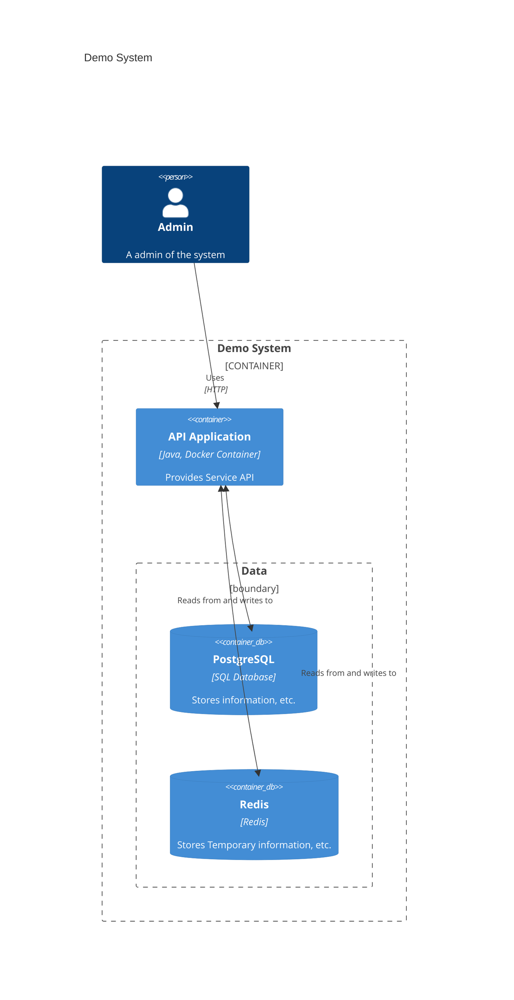

# README



## Components

1. API: .NetCore 6
2. PostgreSQL
3. Redis

## Scenarios

1. API can connect to PostgreSQL Database and Redis
2. API can not connect to PostgreSQL Database
3. API can not connect to Redis

[Health checks in ASP.NET Core](https://learn.microsoft.com/en-us/aspnet/core/host-and-deploy/health-checks?view=aspnetcore-6.0)

## Initial API project

1. New webapi project

   ```sh
   dotnet new webapi -o API
   ```

2. Comment `HttpsRedirection` at `Program.cs`

   ```cs
   // app.UseHttpsRedirection();
   ```

3. Replace `applicationUrl` at `Properties/launchSettings.json`

   ```json
   "applicationUrl": "https://localhost:7170;http://localhost:5183",
   ```

   ```json
   "applicationUrl": "http://localhost:5229",
   ```

4. Create `docker-compose.yaml` with following line

   ```yaml
   version: '3'

   services:
   # api:
   db:
     image: postgres:15.1-alpine3.17
     restart: always
     environment:
     POSTGRES_DB: myDataBase
     POSTGRES_USER: admin
     POSTGRES_PASSWORD: password
     ports:
       - 5432:5432

   cache:
     image: redis:7.0.8-alpine3.17
     restart: always
     ports:
       - 6379:6379
   ```

## Basic health probe

1. The basic configuration registers health check services and calls the Health Checks Middleware to respond at a URL endpoint with a health response.

   ```cs
   var builder = WebApplication.CreateBuilder(args);

   builder.Services.AddHealthChecks();

   var app = builder.Build();

   app.MapHealthChecks("/healthz");

   app.Run();
   ```

2. Start API

   ```sh
   dotnet run
   ```

3. Call `/healthz` with url: `http://localhost:5229/healthz`

## Database probe

1. Install `AspNetCore.Diagnostics.HealthChecks.NpgSql` package for PostgreSQL Database

   ```sh
   cd API
   dotnet add package AspNetCore.HealthChecks.NpgSql
   ```

2. Add NpgSql to HealthChecks

   ```cs
   builder.Services.AddHealthChecks()
       .AddNpgSql(
           builder.Configuration.GetConnectionString("DefaultConnection")
       );
   ```

3. Add `ConnectionStrings` at `appsettings.json`

   ```json
   "ConnectionStrings": {
       "DefaultConnection": "Userid=admin; Password=password; Host=localhost; Port=5432; Database=myDataBase; Pooling=true; MinPoolSize=1; MaxPoolSize=10; ConnectionLifeTime=0;"
   },
   ```

4. Start `docker compose`

   ```sh
   docker compose up -d
   ```

5. Run API and Call `/healthz` with url: `http://localhost:5229/healthz`
6. Stop `db service`

   ```sh
   docker compose stop db
   ```

7. Call `/healthz` with url: `http://localhost:5229/healthz`
8. Start `db service`

   ```sh
   docker compose start db
   ```

9. Call `/healthz` with url: `http://localhost:5229/healthz`
10. Down `docker compose`

    ```sh
    docker compose down
    ```

## Redis probe

1. Install `AspNetCore.Diagnostics.HealthChecks.Redis`

   ```sh
   cd API
   dotnet add package AspNetCore.HealthChecks.Redis
   ```

2. Add Redis to HealthChecks

   ```cs
   builder.Services.AddHealthChecks()
       .AddRedis(builder.Configuration["RedisConnectionString"], "redis", tags: new[] { "cache", "redis" });
   ```

3. Add `RedisConnectionString` at `appsettings.json`

   ```json
   "RedisConnectionString": "localhost:6379",
   ```

4. Start `docker compose`

   ```sh
   docker compose up -d
   ```

5. Run API and Call `/healthz` with url: `http://localhost:5229/healthz`
6. Stop `cache service`

   ```sh
   docker compose stop cache
   ```

7. Call `/healthz` with url: `http://localhost:5229/healthz`
8. Start `cache service`

   ```sh
   docker compose start cache
   ```

9. Call `/healthz` with url: `http://localhost:5229/healthz`
10. Down `docker compose`

    ```sh
    docker compose down
    ```

## Custom Health Checks Result

1. Create filename `CustomHealthCheckWriter.cs` with following code

   ```cs
   using System.Text;
   using System.Text.Json;
   using Microsoft.Extensions.Diagnostics.HealthChecks;

   namespace api
   {
       public class CustomHealthCheckWriter
       {
           public static Task WriteResponse(HttpContext context, HealthReport healthReport)
           {
               context.Response.ContentType = "application/json; charset=utf-8";

               var options = new JsonWriterOptions { Indented = true };

               using var memoryStream = new MemoryStream();
               using (var jsonWriter = new Utf8JsonWriter(memoryStream, options))
               {
                   jsonWriter.WriteStartObject();
                   jsonWriter.WriteString("status", healthReport.Status.ToString());
                   jsonWriter.WriteStartObject("results");

                   foreach (var healthReportEntry in healthReport.Entries)
                   {
                       jsonWriter.WriteStartObject(healthReportEntry.Key);
                       jsonWriter.WriteString("status",
                           healthReportEntry.Value.Status.ToString());
                       jsonWriter.WriteString("description",
                           healthReportEntry.Value.Description);
                       jsonWriter.WriteStartObject("data");

                       foreach (var item in healthReportEntry.Value.Data)
                       {
                           jsonWriter.WritePropertyName(item.Key);

                           JsonSerializer.Serialize(jsonWriter, item.Value,
                               item.Value?.GetType() ?? typeof(object));
                       }

                       jsonWriter.WriteEndObject();
                       jsonWriter.WriteEndObject();
                   }

                   jsonWriter.WriteEndObject();
                   jsonWriter.WriteEndObject();
               }

               return context.Response.WriteAsync(
                   Encoding.UTF8.GetString(memoryStream.ToArray()));
           }
       }
   }
   ```

2. Add `HealthCheckOptions` to `app.MapHealthChecks`

   ```cs
   app.MapHealthChecks("/healthz", new HealthCheckOptions
   {
       ResponseWriter = CustomHealthCheckWriter.WriteResponse
   });
   ```

3. Start `docker compose`

   ```sh
   docker compose up -d
   ```

4. Run API and Call `/healthz` with url: `http://localhost:5229/healthz`
5. Stop `cache or db service`

   ```sh
   docker compose stop cache
   ```

   ```sh
   docker compose stop db
   ```

6. Call `/healthz` with url: `http://localhost:5229/healthz`
7. Start `cache service`

   ```sh
   docker compose start cache
   ```

   ```sh
   docker compose start db
   ```

8. Call `/healthz` with url: `http://localhost:5229/healthz`
9. Down `docker compose`

   ```sh
   docker compose down
   ```
